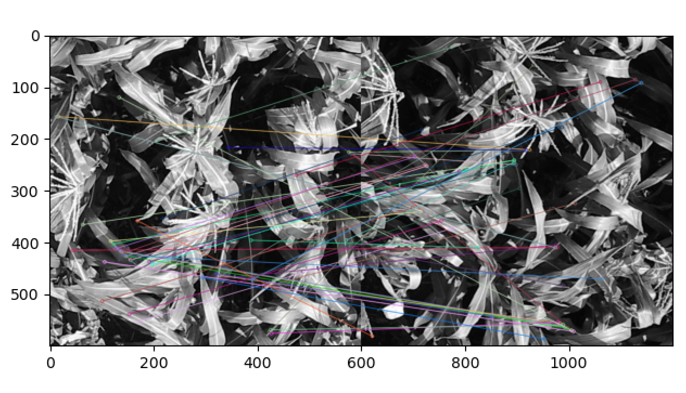

title = "SIFT的浅学"

date = 2020-04-25T15:25:51+08:00

categories = ["CV"]
tags = ["学习"]
postauthor = ["cen"]
draft = false

+++

## SIFT的浅学


SIFT的学习

理论我就不多说了，我自己听了一下午，也没听懂，反正挺复杂的，我就是想试试效果。做个对比实验

```python
import cv2
import matplotlib.pyplot as plt


# read images
img1 = cv2.imread('DJI_0023_34.jpg')
img2 = cv2.imread('DJI_0025_37.jpg')

img1 = cv2.cvtColor(img1, cv2.COLOR_BGR2GRAY)
img2 = cv2.cvtColor(img2, cv2.COLOR_BGR2GRAY)

#sift
sift = cv2.xfeatures2d.SIFT_create()

keypoints_1, descriptors_1 = sift.detectAndCompute(img1,None)
keypoints_2, descriptors_2 = sift.detectAndCompute(img2,None)

#feature matching
bf = cv2.BFMatcher(cv2.NORM_L1, crossCheck=True)

matches = bf.match(descriptors_1,descriptors_2)
matches = sorted(matches, key = lambda x:x.distance)

img3 = cv2.drawMatches(img1, keypoints_1, img2, keypoints_2, matches[:50], img2, flags=2)
plt.imshow(img3),plt.show()
```

用了网上的代码，其中比较麻烦的是，不仅要安装opencv-python，还要安装opencv-contrib-python这个包，而且你安装的版本还不能太高，试了半天，最终把opencv-contrib-python降到3.3.0.10才可以的，最好是在一个新的项目中实现这个代码。

结果图：



但是吧，我也没看出来，能不能检测玉米雄穗，也不知道检测的好不好~但是我感觉吧，检测的很不好~